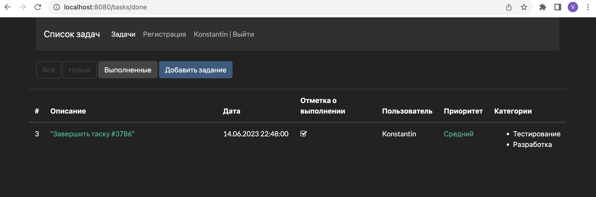
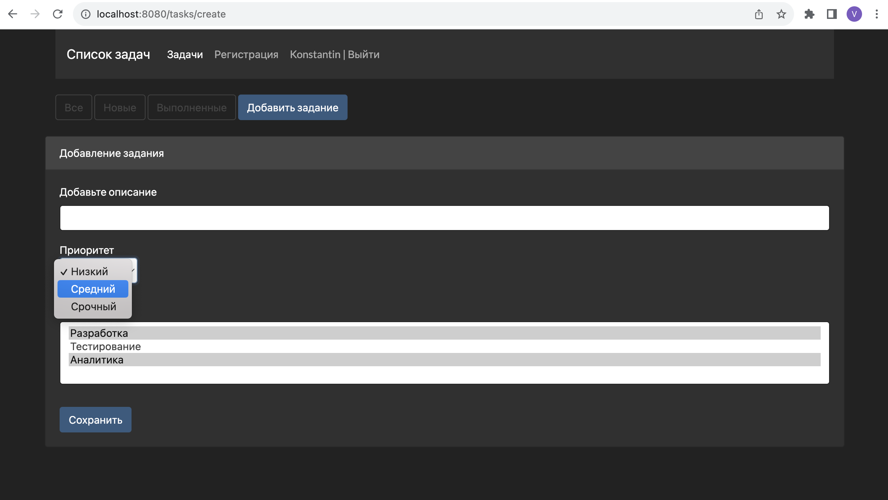
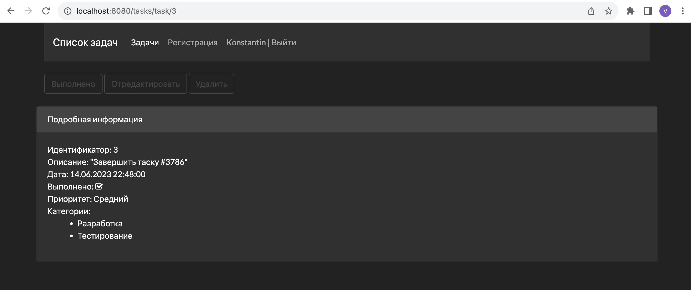
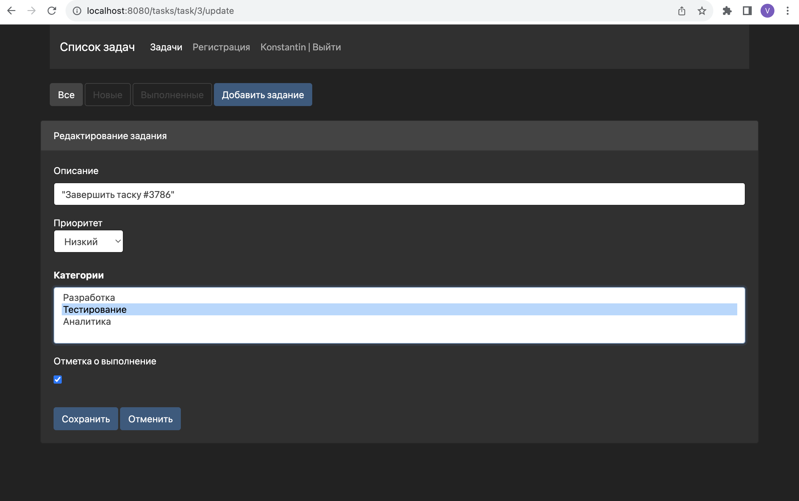
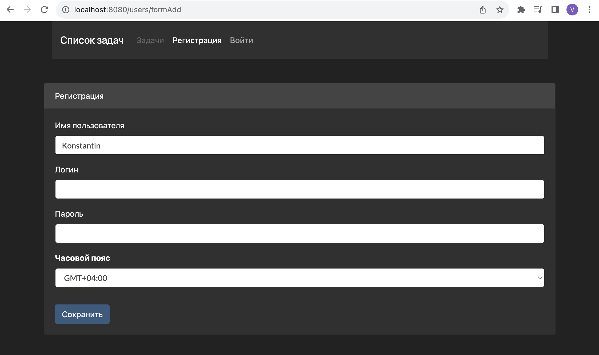

# job4j_todo
### Проект "Список задач"

Веб приложение на языке Java с библиотекой Spring boot.

Сайт по ведению дел. Главная страница со списком всех заданий. В таблице отображается имя, дата создания и состояние задание (выполнено или нет).

Доступны действия:
- Добавить задание.
- Списки: все задания, только выполненные или только новые.
- Подробное описанием.
- Действия над заданием: выполнить, отредактировать, удалить.
- Если нажали на кнокпу выполнить, то задание переводиться в состояние выполнено.
- Кнопка редактировать переводит пользователя на отдельную страницу для редактирования.
- Кнопка удалить, удаляет задание и переходит на список всех заданий.

### Используемые технологии

### Архитектура приложения трехслойное
- Слой контроллеры
- Слой сервисы
- Слой работы с БД

### Требуемое окружение
- JDK 17
- Apache Maven 3.8.5
- PostgreSQL 13
- Браузер

### Подготовка к запуску приложения
- Создать БД todo хост `jdbc:postgresql://localhost:5432/todo`
- Собрать jar с приложением, выполнив команду `mvn install`
- Запустить приложение из папки target, выполнив команду: `java -jar job4j_todo-1.0-SNAPSHOT.jar`
- Перейти в браузере по ссылке `http://localhost:8080/todo`

### Главная страница, форма со всеми задачами

### Страница с новыми задачами

### Страница с выполненными задачами

### Добавление новой задачи

### Детальная информация по задаче

### Редактирование задачи

### Ошибка обновления задачи

### Ошибка удаления задачи

### Регистрация нового пользователя

### Пользователь существует

### Пользователь успешно зарегистрирован

### Сраница авторизации

### Неверный логин или пароль

### Контакты
kanmikhaylov@gmail.com
